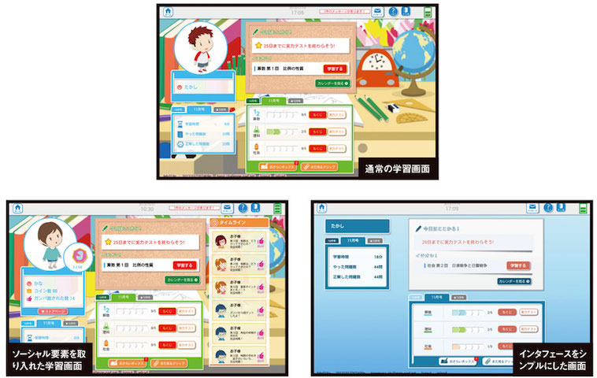
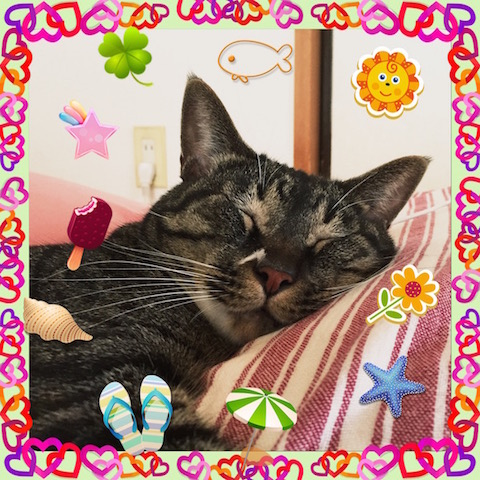

class: center, middle

# Backbone, Chaplin, Marionette そして React - Quipper における Single Page Application 開発の変遷

.right[Kensuke Nagae (@kyanny)]

.right[Aug 18 2015, Ginza.rb]

---

class: center, middle

あ…ありのまま 今　起こった事を話すぜ！

「おれは　Railsエンジニアとして転職したと  
思ったら　いつのまにかSPAばかり書いていた」

---

# お話すること

* おさらい: なぜSPAなのか、なぜJavaScriptフレームワークなのか
* Quipperでこれまで採用してきたJavaScriptフレームワークと所感
  * Backbone
  * Chaplin
  * Marionette
  * React
* RailsとSPAの共存
* SPAに向いているAPIの設計と実装

---

# おさらい: なぜSPAなのか

* モバイルネイティブアプリの速度にWeb技術で対抗するため

---

* モバイルWebの起動は遅い（3G/750Kbps）

<video src="regular-3g-load.mov" controls></video>

---

* タップごとに何秒も待てない、SPAの「のろさ」なら我慢できる

<video src="regular-3g-quiz.mov" controls></video>

---

# おさらい: なぜJavaScriptフレームワークなのか

* 素朴にjQueryとAjaxで込み入ったアプリケーションを作ると破綻する
* JavaScriptアプリケーションの世界にも複雑さにたえうるアーキテクチャが求められた

---

# QuipperとSPA

* Quipperの主力製品
  * QLink（先生向け 宿題配信 成績管理）
  * QLearn（生徒向け 学習アプリ モバイル対応）
  * QCreate（教材コンテンツ制作用CMS）
* いつのまにかすべてJavaScriptフレームワークによるSPAへと変貌
  * 内訳（昔）: Backbone x 1, Marionette x 2
  * 内訳（今）: Marionette x 3

---

# SPA採用の理由

* これといって特になし（実話）
  * ネイティブアプリ開発者が少なく、Web開発者が多かったので、ごく自然に
  * Webかネイティブか？という議論は多少あった
  * SPAか「古きよきウェブアプリケーション」か、は議論にすらならなかった

---

# Backbone

* 最初に採用されたJavaScriptフレームワーク（2013年春）
* モバイル対応必須のアプリだったためSPAとして実装
* 狙いどおり応答性の高いアプリケーションが実現できた（デモ動画がコレ）
* しかしコードベースはちょっと複雑

---

# Backbone最大のウソ

* × 背骨（骨格）
* ○ バラバラの骨
  * 正しい骨格の組み方を知らないと、いびつに

---

* 困るパターン[要出典]: initialize に詰め込みすぎ

```javascript
var AppView = Backbone.View.extend({
  initialize: function() {
    this.foo = new Foo();
    this.bar = new Bar();
    this.baz = new Baz();
    this.qux = new Qux();
    this.quux = new Quux();

    // どんだけいっぱい new してるんだよ...（何行も続く）

    this.render(); // で render かよ！テストしづらいからやめてほしい...
    return this;
  }
});
```

---

* 困るパターン[独自研究]: render に詰め込みすぎ

```javascript
var AppView = Backbone.View.extend({
  render: function() {
    this.$el.html(this.template(this.model.attributes));

    // Foo() インスタンスの後始末は誰が？
    this.$el.find('.selector').html((new Foo()).render().$el.html())

    (new Bar()).render(); // Bar() インスタンスは一体どこに何を render してるの？？

    return this;
  }
});
```

---

# [Chaplin](http://chaplinjs.org/)

* Backboneベースで規約が多いフレームワーク（Railsっぽい）
* Backboneで作られたアプリとほぼ同時期に別プロジェクトで採用
  * 小学生向けタブレット学習サービス（2013年初夏〜2014年夏）
  * Backboneの場合と同じくモバイル対応必須かつWeb開発者しかいなかったため、JavaScriptフレームワーク以外の選択肢無し
  * Backboneで大規模アプリ開発を経験した人の知見「Backboneだけでは破綻するので一段上のフレームワークが必要」
  * Angularが流行り始めていて検討したが「管理画面向け」という噂だったので採用せず

---

.center[]

.right[[ベンチャーが日本の企業を強くする - ベネッセ、ベンチャーと組み“個”の学びを素早く提供：ITpro](http://itpro.nikkeibp.co.jp/article/COLUMN/20140430/553923/?s2p)]

---

# Chaplinで苦労したところ

* ビルド周りの融通の利かなさ（Brunch以外の選択肢を選びづらい）
* @reuse の扱いづらさ
  * 実質キャッシュ、Marionetteとの思想の違い

---

(chaplin impl)

---

# Marionette

* Backboneベースで規約が少ないフレームワーク
* 前述のBackbone/Chaplinアプリを作ったあとに採用（2014年）
  * ふつうのRailsアプリだったQLinkを「レスポンスの遅さ」解決のためにSPA化
  * 同時期にやはりふつうのRailsアプリだったQCreateのリニューアルでも採用
  * Chaplin採用プロジェクトメンバーからのフィードバック「強くは推さない」
* その後Backboneで作られていたQLearnもMarionetteに移行

# Marionetteの便利なところ

* LayoutViewのわかりやすさと汎用性
* moduleによるきれいなアーキテクチャの実現

---

(marionette impl)

---

# Chaplin vs Marionette

* 思想の違い
  * フレームワーク側で頑張ろうとするChaplin
  * 便利なパーツを用意して開発者に任せるMarionette
* リスク承知でレールを外れざるをえないのがフロントエンドの世界
* 無茶して規約を迂回するリスクを払わずに済むMarionetteのほうが後々ラク

---

# React

* 新機能（チャット付きライブ授業）用に採用
  * 当時@mizchiがReact にハマっていたため[要出典]
  * 新規プロジェクトで新しい技術を試すのはよくあること
  * リアルタイム性はReact関係なくPusherを使って実現

---

# Reactの美しいところ

* △ バーチャルDOMだからはやい
* ○ 「毎回画面を全部書き換える」古きよき単純なアーキテクチャへ回帰したことがすごい
* シンプルなアーキテクチャのパフォーマンス面での問題を実装で解決したのがバーチャルDOM
  * それ自体技術的には高度ですごいが、そもそものアーキテクチャ的な正しい判断があってこそ活きる
* [http://kyanny.github.io/what-i-have-learnt-about-react-so-far/](http://kyanny.github.io/what-i-have-learnt-about-react-so-far/)

---

# Javascriptフレームワークおすすめは？

* Backbone.Eventを理解している人は...
  * ○ Marionette
  * とてもおすすめ（API豊富、ドキュメント充実、安定）
* SPAこれから始める人は...
  * ？ Angular
  * 日本語の情報が多いのでいいんじゃないでしょうか
* Reactがどうしても気になる人は...
  * ○ React
  * アクティブに情報を追わないといけないがトライする価値はある

---

# RailsとSPAの共存

```
app/
├── assets
│   ├── images
│   ├── javascripts
│   │   ├── application.coffee
│   │   ├── modules
│   │   │   ├── dashboard
│   │   │   │   ├── controller.js.coffee
│   │   │   │   ├── models
│   │   │   │   │   └── dashboard.js.coffee
│   │   │   │   ├── router.coffee
│   │   │   │   └── views
│   │   │   │       └── dashboard_view.js.coffee
```

* app/controllers 以下はほぼ全て JSON API

---

# 共存させるメリット・デメリット

* ○ デプロイやインテグレーションで悩むことが減る（CORSなど）
* ○ Sprockets任せはけっこう楽
* × Grunt/gulpなどNode.jsなフロントエンドツールを使いづらい
* × デプロイが遅い（assets:precompileが遅い）

---

# 共存させるときのTips

* index.htmlをrenderするactionが一個ある（BackboneController#index）
* リロード404対策のためにroutes.rbはこんな感じにする

```ruby
QuipperLink::Application.routes.draw do
  root :to => 'backbone#index'

  scope controller: 'backbone', action: 'index' do
    get "/dashboard" # <-- Backbone.Routerが書き換えるURLのパス部分
    get "/settings"
    get "/logout"
  end
end
```

---

# SPA時代のAPIのあり方

* scaffoldっぽいAPIはSPAから使いづらい

```javascript
// 理想
this.user = new User();
this.user.fetch().done(function(){
  this.$el.html(this.template(this.user.attributes));
});

// 現実
this.user = new User();
this.news = new News();
this.messages = new Messages();
this.campaigns = new Campaigns();
$.when(this.user.fetch(), this.news.fetch(), this.messages.fetch(), this.campaigns.fetch()).done(function(){
  // 一つの画面が必要とするリソースが一つで済むわけではない！
})
```

---

# SPAに向いているAPIとは

* クライアントサイドに都合の良いデータをまとめて返すAPI
* 「アプリにべったりなAPI実装、気持ち悪い...」
  * Web開発者はサーバサイドで込み入ったことをするほうが楽
  * 単純なRuby + 込み入ったJavaScript
  * 単純なJavaScript + 込み入ったRuby
  * どっちがいいですか？
* [例えば OSFA な API をやめる](http://blog.kyanny.me/entry/2014/03/06/%E4%BE%8B%E3%81%88%E3%81%B0_OSFA_%E3%81%AA_API_%E3%82%92%E3%82%84%E3%82%81%E3%82%8B)
* Netflixという偉大な前例

---

# お話したこと

* おさらい: なぜSPAなのか、なぜJavaScriptフレームワークなのか
* Quipperでこれまで採用してきたJavaScriptフレームワークと所感
  * Backbone
  * Chaplin
  * Marionette
  * React
* RailsとSPAの共存
* SPAに向いているAPIの設計と実装

---

# ありがとうございましたミ☆

.center[]
